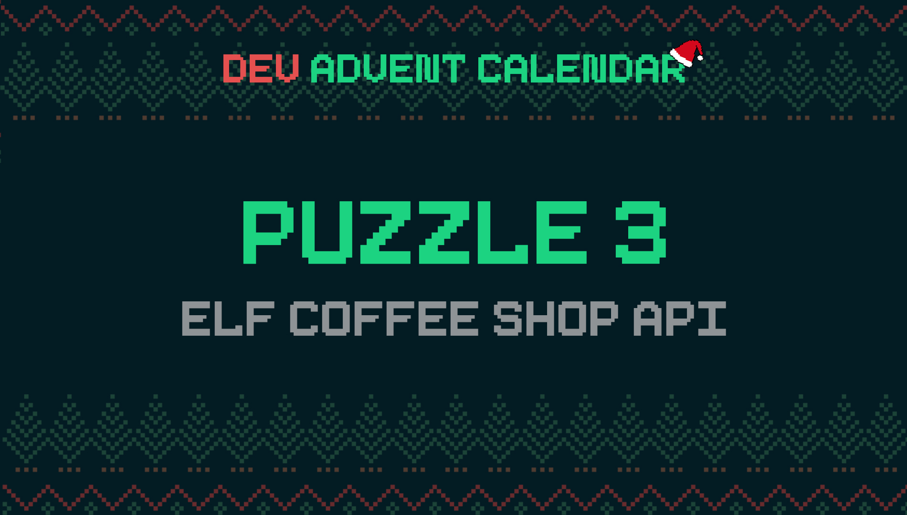

ℹ️ For detailed information about the contest, check out [devadvent/readme](https://github.com/devadvent/readme/)

# Dev Advent Calendar 🎅 Puzzle 3 - Elf Coffee Shop API 🧝🥤

[Yesterday's puzzle](https://github.com/devadvent/puzzle-2) was about creating the menu for the Elf Coffee Shop. The owner was very satisfied with the result.

Due to the high demand, the savy entrepreneur hired someone to make an app where elves can order their drink, and it would be delivered home, or to their workplace.

The only thing missing is a REST API to get the drinks.
It is your job to populate the API with the correct data, so it can be consumed by the app.

## 🧩 The puzzle

The REST API is already set up, but you need to prepare the menu data in a specific way.

> This puzzle might be a little bit harder than the previous. But I am sure you can do it 💪

### 1️⃣ First step

Complete the function `prepareForApi` in the file [utils/menu.js](utils/menu.js): Return an array of every item on the menu, with some additional data:

-   `name`: Complete name, consisting of flavor + drink. Drinks with no extra flavors will just ommit the flavor field. (e.g. Hot Chocolate, Gingerbread Latte, Peppermint Cappuccino, etc.)
-   `slug`: A slugified version of the name (check /utils/helpers.js) (e.g. hot-chocolate, gingerbread-latte, peppermint-cappuccino, etc.)
    Example:

         ```javascript
         [
             {
                 drink: 'Latte',
                 flavor: 'Gingerbread',
                 price: 4.5,
                 name: 'Gingerbread Latte',
                 slug: 'gingerbread-latte',
             },
             ...
         ]
         ```

### 2️⃣ Second step

For the first step to work, you also need to complete the `slugify` function in the [utils/helpers.js](utils/helpers.js).

Return a "slugified" version of a given text (String). This means:

-   Everything in lowercase
-   Replace all letters with accents, umlauts, etc. to a normalized letter (e.g. `Déjà Vu` ➡️ `deja-vu`, `Jürgen` ➡️ `jurgen`, etc.) (💡 hint: https://stackoverflow.com/questions/990904/remove-accents-diacritics-in-a-string-in-javascript)
-   Replace all other non-alphanumeric characters (incl. spaces) with a hyphen (-)
-   Remove leading and trailing hyphens (`-test-123` ➡️ `test-123`, `hello-world-` ➡️ `hello-world`)
-   Multiple consecutive hyphens should replaced with a single hyphen (`some-----spaces` ➡️ `some-spaces`)

## 🚢 Ship your solution

Check out the [contributing guide](https://github.com/devadvent/readme/blob/main/CONTRIBUTING.md) for details about how to participate.

In short:

-   ✨ Create your repository by [acceping the assignment](https://classroom.github.com/a/XXXXXX) using the participation link
-   🧩 Solve the puzzle
-   🐦 Add your Twitter handle to `twitter.js`
-   🤖 Test your solution
-   🚀 Upload your changes to the `main` branch

## 🔗 Participation link

In order to participate, you need to enter the following link and accept the assignment:
[https://classroom.github.com/a/XXXXXX](https://classroom.github.com/a/XXXXXX)

## 💻 Use this project

### ⏳ Install the dependencies

Install the dependencies with

```bash
yarn install
```

or

```bash
npm install
```

### ⚙️ Run the code

Run the code with

```bash
yarn dev
```

or

```bash
npm run dev
```

💡 You can consume the API by directing your browser to [http://localhost:3000/api/menu]

### 🤖 Test your solution

This puzzle is equipped with automated tests (in the `./tests` folder). In order for your solution to qualify for winning the daily prize, **all** tests need to pass.

To run these tests, execute one of the following commands in your console:

```bash
yarn test
```

or

```bash
npm test
```
